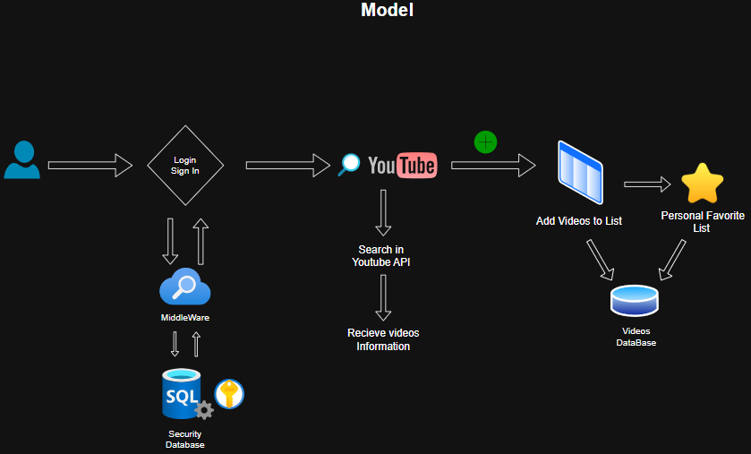
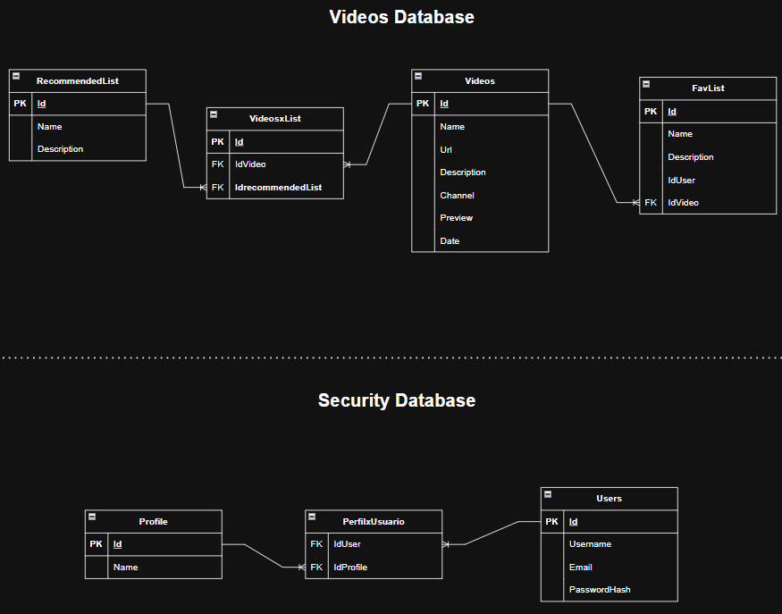

# API-Youtube

This project leverages the YouTube API to search for videos based on keywords and add the results to custom recommendation lists. It implements an authentication and authorization system using OAuth 2.0 to ensure that only authenticated users can interact with and modify these lists. Additionally, the project integrates a custom middleware that handles requests and responses, providing additional control and security over the operations performed on the YouTube API. The middleware ensures that only users with the appropriate permissions can modify the lists, managing communication with the API efficiently and securely.

## Model
Below is the model used for this project:

## ER Diagram
Here is the Entity-Relationship (ER) Diagram showing the relationships between the entities:

## Features
- Search videos from YouTube API
- Add videos to recommendation lists and Fav List
- OAuth 2.0 authentication and authorization
- Custom middleware for API interaction (Is in my profile)
